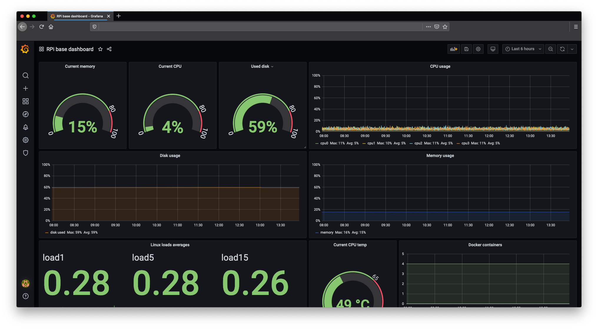

# RPi monitoring

## With Telegraf, InfluxDB and Grafana

This repository is based on the work of [Bernardo Ronquillo Japón](https://github.com/brjapon)  https://github.com/therobotacademy/InfluxBD-Telegraf-Chronograph

## Running the stack
- Install docker
- Install docker-compose
- Clone this repository and open project folder
- Setup Telegraf config file `cp telegraf/example.telegraf.conf telegraf/telegraf.conf`
- Run `docker-compose up -d`

## Setup Grafana
- Visit Grafana interface at http://<rpi_local_addr>:3000 .
- Connect influxdb as source
- Import the base dashboard from /grafana/RPi_base_dashboard-1609948698396.json

The Grafana dashboard will look like this:

